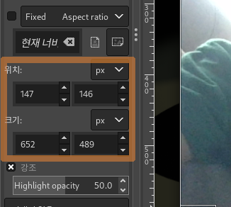
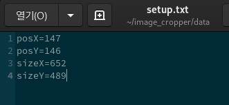

# 자동 이미지 잘라내기
여러 이미지들의 동일한 구간을 잘라내는 프로그램
 주로 무자비하게 찍힌 스크린샷을 정리하는 용도로 이용됩니다

실행 파일 
Windows: 준비중

OS X: 준비중

Linux: [Linux-64bit.zip 파일](https://github.com/is2you2/image_cropper/raw/master/exports/image_cropper_linux64.zip)

## 사용방법

 보다 정확한 편집을 위해서 적어도 한 번은 편집구간을 확인해주어야 합니다.

 위치와 크기값이 확인되었다면 data 폴더 안에 있는 setup.txt 파일에
확인된 위치와 크기값을 입력해주세요.

잘 이용하셨다면 Esc 또는 창 닫기 버튼을 눌러 종료해주세요.

## 사용시 주의사항
1. result 폴더에 결과물이 생성될 때 덮어쓰기 방식으로 파일을 생성합니다.
2. 여러 파일을 한번에 받아낼 수 없습니다. 여러 파일을 일괄 작업할 경우 폴더에 모아서 폴더를 올려주세요.
 이 경우 해당 폴더의 한단계 아래있는 파일들만 불러와집니다.